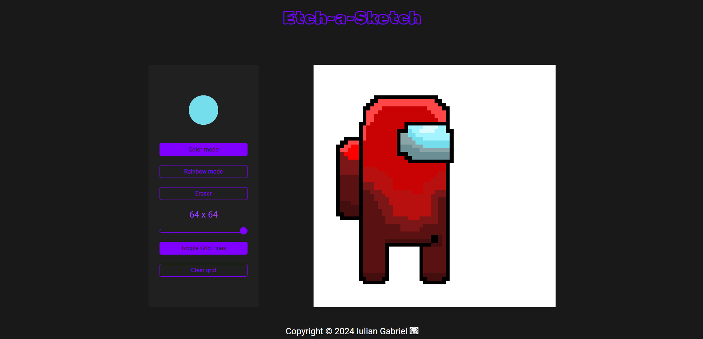

<h1 align="center">Etch-a-Sketch App</h1>

<p align="center">
  
</p>

<p align="center">
  <a href="https://iuliangabriel.github.io/Etch-a-Sketch/" style="display:inline-block;">Live App</a>
</p>

## Features

- **Drawing Canvas**: Create drawings on a customizable grid.
- **Color Modes**: Choose colors, use the rainbow mode, or erase if you need.
- **Grid Controls**: Adjust grid size and toggle grid lines.
- **Clear Canvas**: Start fresh with a single click.

## Usage

1. Select a color or mode.
2. Draw on the canvas.
3. Enjoy!

## Technologies used
- HTML5
- CSS3
- JavaScript

## Installation

1. Clone the repository:

  ```bash
   git clone https://github.com/IulianGabriel/Etch-a-Sketch
